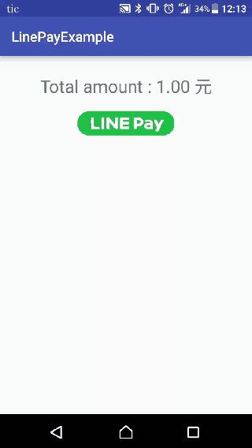
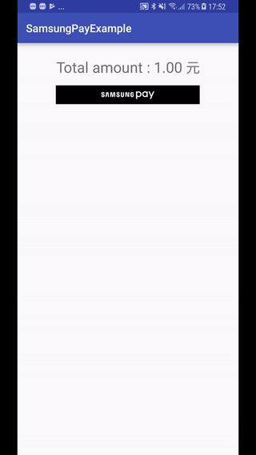

# tappay-android-example

TapPay SDK example code for Android Platform.


TapPay Android SDK is used to get token(i.e. prime) on Android platform for charging a credit card.

>Obtain your app id and keys here.
     https://www.tappaysdk.com/en


# Demo
## Direct Pay


## Google Pay


## LINE Pay


## Samsung Pay



# Usage

## Direct Pay
1. Import tpdirect.aar into your project.
2. Use TPDSetup to initialize the SDK and setup environment.
    ```Java
    TPDSetup.initInstance(getApplicationContext(), "APP_ID", "APP_KEY"
    , TPDServerType.Sandbox);
    ```
3. Add TPDForm in your layout.
    ```xml
    <tech.cherri.tpdirect.api.TPDForm  
        android:id="@+id/tpdForm"  
        android:layout_width="wrap_content"  
        android:layout_height="wrap_content">  
    </tech.cherri.tpdirect.api.TPDForm>
    ```

4. Setup TPDCard with TPDForm. 
    ```Java
    TPDCard card = TPDCard.setup(TPDForm tpdForm)
        .onSuccessCallback(new TPDTokenSuccessCallback(){
            @Override
            public void onSuccess(String prime, TPDCardInfo cardInfo) {
            //get Prime succeeded. }
            }
        ).onFailureCallback(new TPDTokenFailureCallback(){
            @Override
            public void onFailure(int status, String reportMsg) {
            //get Prime failed. }
        });
    ```

5. Fill credit card information in TPDForm and get Prime from TapPay.
    ```Java
    card.getPrime();
    ```
    
## Google Pay

1. Import tpdirect.aar into your project.
2. Add dependencies into your app's **build.gradle**
    ```
    compile 'com.android.support:appcompat-v7:24.1.1'
    compile 'com.google.android.gms:play-services-wallet:16.0.0'
    ```
3. Add below metadata in AndroidManifest.xml
    ```xml
    <meta-data
        android:name="com.google.android.gms.version"
        android:value="@integer/google_play_services_version" /> 
    <meta-data
        android:name="com.google.android.gms.wallet.api.enabled"
        android:value="true" />
    ```

4. Use TPDSetup to initialize the SDK and setup environment.
    ```Java
    TPDSetup.initInstance(getApplicationContext(), "APP_ID", "APP_KEY"
    , TPDServerType.Sandbox);
    ```
5. Create : 
    - TPDMerchant for Google Pay process 
    ```
    TPDMerchant tpdMerchant = new TPDMerchant();
    tpdMerchant.setSupportedNetworks(allowedNetworks);
    tpdMerchant.setSupportedAuthMethods(allowedAuthMethods);
    tpdMerchant.setMerchantName("Your merchant name");
    ```
    - TPDConsumer for requiring consumer's payment detail.
    ```
    TPDConsumer tpdConsumer = new TPDConsumer();
    tpdConsumer.setPhoneNumberRequired(true);
    tpdConsumer.setShippingAddressRequired(true);
    tpdConsumer.setEmailRequired(true);
    ```

6. Setup TPDGooglePay with TPDMerchant and TPDConsumer.
    ```Java
    TPDGooglePay tpdGooglePay = new TPDGooglePay(this, tpdMerchant, tpdConsumer);
    ```

7. Check Google Pay availability.
    ```
    tpdGooglePay.isGooglePayAvailable(TPDGooglePayListener var1);
    ```

8. Obtain PaymentData.
    ```
    tpdGooglePay.requestPayment(TransactionInfo.newBuilder()
                    .setTotalPriceStatus(WalletConstants.TOTAL_PRICE_STATUS_FINAL)
                    .setTotalPrice("1")
                    .setCurrencyCode("TWD")
                    .build(), LOAD_PAYMENT_DATA_REQUEST_CODE);
    ```
    
9. Get Prime from TapPay.
    ```
     tpdGooglePay.getPrime(paymentData, TPDTokenSuccessCallback, TPDTokenFailureCallback);
    ```
    
    
## LINE Pay

1. Import tpdirect.aar into your project.
2. Use TPDSetup to initialize the SDK and setup environment.
    ```Java
    TPDSetup.initInstance(getApplicationContext(), "APP_ID", "APP_KEY"
    , TPDServerType.Sandbox);
    ```
3. Add below intent-filter to an Activity for receiving LINE Pay Result in AndroidManifest.xml and set launch mode to "SingleTask"
    
    For example :
    ```xml
     <activity
            android:name=".LinePayActivity"
            android:launchMode="singleTask">
        <intent-filter>
            <action android:name="android.intent.action.VIEW" />

            <category android:name="android.intent.category.DEFAULT" />
            <category android:name="android.intent.category.BROWSABLE" />

            <data
                android:host="tech.cherri"
                android:scheme="linepayexample" />
        </intent-filter>
    </activity>
    ```
4. Check LINE Pay availability.
    ```
    boolean isLinePayAvailable =TPDLinePay.isLinePayAvailable(Context context);
    ```
    
5. Setup TPDLinePay with uri which is formed with host and scheme(both declared in Step3).
 
   For example:
    ```
    TPDLinePay tpdLinePay = new TPDLinePay(Context context, "linepayexample://tech.cherri");
    ```
    
6. Open corresponding LinePay payment method by paymentUrl obtained from TapPay pay-by-prime API
    ```
     tpdLinePay.redirectWithUrl(paymentUrl);
    ```
7. Receive LinePayResult in Activity life cycle "onCreate" or "onNewIntent" (depend on the activity had been destroyed or not)
    ```
    tpdLinePay.parseToLinePayResult(Context context, intent.getData(), TPDLinePayResultListener listener);
    ```
8. Obtain TPDLinePayResult in "onParseSuccess"
TPDLinePayResult has:
    - status (0 = Success , 924 = Canceled by User)
    - recTradeId 
    - bankTransactionId 
    - orderNumber


## Samsung Pay

1. Import tpdirect.aar and samsungpay-1.x.jar into your project.

2. Add below meta data to your application tag in AndroidManifest.xml
    
    For example :
    ```xml
      <application
        android:icon="@mipmap/ic_launcher"
        android:theme="@style/AppTheme"
        .
        .
        .>

          <!--Set to 'N' if in release mode.-->
        <meta-data
            android:name="debug_mode"
            android:value="Y" />

        <meta-data
            android:name="spay_sdk_api_level"
            android:value="1.8" />
        
        <!--Debug Key is valid for 3 months;-->
        <!--Remove below metadata if in release mode-->
        <meta-data
            android:name="spay_debug_api_key"
            android:value=“{Your debug_api_key obtained from Samsung}” />

       <activity android:name=".MainActivity">
            <intent-filter>
                <action android:name="android.intent.action.MAIN" />
                <category android:name="android.intent.category.LAUNCHER" />
            </intent-filter>
        </activity>

    ```
3. Use TPDSetup to initialize the SDK and setup environment.
    ```Java
    TPDSetup.initInstance(getApplicationContext(), "APP_ID", "APP_KEY"
    , TPDServerType.Sandbox);
    ```

4. Create TPDMerchant for Samsung Pay process 
    ```
    TPDMerchant tpdMerchant = new TPDMerchant();
    tpdMerchant.setMerchantName(“Your Merchant Name");
    tpdMerchant.setSupportedNetworks(allowedNetworks);
    tpdMerchant.setSamsungMerchantId(“Your SamsungMerchantId obtained from TapPay Portal”));
    tpdMerchant.setCurrencyCode("TWD");

    ```
5. Setup TPDSamsungPay with TPDMerchant and service Id
    ```Java
    TPDSamsungPay tpdSamsungPay = new TPDSamsungPay(Context context, "Your serviceId obtained from Samsung", tpdMerchant);
    ```

6. Check Samsung Pay availability.
    ```
    boolean isSamsungPayAvailable =tpdSamsungPay.isSamsungPayAvailable(TPDSamsungPayStatusListener listener);
    ```
    
7. Get Prime from TapPay.
    ```
    tpdSamsungPay.getPrime(itemTotalAmount, shippingPrice, tax, totalAmount, TPDTokenSuccessCallback, TPDTokenFailureCallback);
    ```
